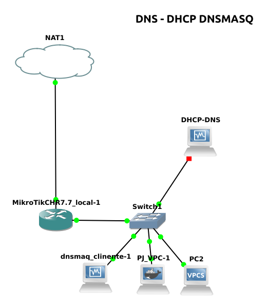

# Configuración DNSMASQ

Documento de ayuda y ampliación https://sio2sio2.github.io/doc-linux/06.infraestructura/02.dhcp/03.dnsmasq.html

Dnsmasq es una herramienta de software de código abierto que combina funcionalidades de servidor DNS y servidor DHCP en una sola aplicación. Su nombre proviene de "DNS" (Domain Name System) y "masq" (masquerading). Dnsmasq es conocido por ser ligero y fácil de configurar, y se utiliza comúnmente para funciones de red en sistemas Linux y enrutadores.

Las principales funciones de dnsmasq incluyen:

1. **Servidor DNS:** Dnsmasq proporciona resolución de nombres de dominio, lo que significa que traduce nombres de host legibles por humanos en direcciones IP. Puede utilizarse como un servidor DNS local para resolver nombres de dominio en una red privada.

1. **Servidor DHCP:** Dnsmasq también puede funcionar como un servidor DHCP que asigna direcciones IP automáticamente a dispositivos en una red local. Esto es útil para la gestión de direcciones IP en una red doméstica o empresarial.

1. **Redirección de dominio:** Permite la redirección de nombres de dominio a direcciones IP específicas, lo que facilita la configuración de servicios locales o personalizados, como servidores web internos.

1. **Cache de DNS:** Dnsmasq incluye una caché de DNS que almacena en memoria las consultas de DNS previamente resueltas, lo que acelera las respuestas a futuras consultas repetidas.


## Instalación 
```sh
$ sudo apt install dnsmasq
```
## Escenario para las prácticas


Trabajaremos en la red 192.168.10.0/24

## Configuramos la funcioanlidad de DHCP
```sh
$ sudo vi /etc/dnsmasq.conf
```
    port 53

Reiniciamos el servicio y con un status vemos que hay conflicto en el puerto 53
Para que no de conflicto con el puerto 53 del system resolved

DNSStubListener=no en el fichero /etc/systemd/resolved.conf (https://unix.stackexchange.com/questions/304050/how-to-avoid-conflicts-between-dnsmasq-and-systemd-resolved)
DNSStubListener=no: Cuando está configurado en "no", systemd-resolved no escuchará ni responderá a las consultas DNS en el puerto 53. En cambio, redirigirá estas consultas a través de la interfaz local de D-Bus hacia otros servicios DNS que puedan estar configurados en el sistema. Esto permite que otro software, como dnsmasq o un servidor DNS personalizado, gestione las consultas DNS
Seguimos configurando 

```sh
sudo vi /etc/dnsmasq.conf
```

    listen-address=127.0.0.1
    listen-address=192.168.10.2

    dhcp-range=192.168.10.11,192.168.10.200

    dhcp-option=3,192.168.10.1  # Configura la puerta de enlace
    dhcp-option=6,192.168.10.2  # Configura el servidor DNS


Con el comando /usr/sbin/dnsmasq --help dhcp podemos ver las distintas opciones dhcp-option

**listen-address=127.0.0.1**
Esto configura dnsmasq para escuchar en la dirección IP 127.0.0.1, que es la dirección loopback, lo que significa que dnsmasq solo atenderá solicitudes DNS desde la propia máquina donde se ejecuta.

**listen-address=192.168.10.2**
Esto configura dnsmasq para escuchar en la dirección IP 192.168.10.2, lo que permite que dnsmasq atienda solicitudes DNS en la red local desde esa dirección IP.

**dhcp-range=192.168.10.10,192.168.10.200,24h**
Esta línea establece un rango de direcciones IP para el servidor DHCP. En este caso, las direcciones IP para los clientes de DHCP estarán en el rango de 192.168.10.10 a 192.168.10.200. Los clientes de DHCP obtendrán una dirección IP de este rango cuando se conecten a la red y recibirán un alquiler de 24 horas para su dirección IP asignada.

**dhcp-option=option:dns-server,192.168.10.2,8.8.8.8**
Esta línea configura las opciones DHCP que los clientes recibirán al obtener una dirección IP a través del servidor DHCP. En este caso, se establece la opción de servidor DNS (dns-server) con dos servidores DNS: 192.168.10.2 y 8.8.8.8. Los clientes utilizarán estos servidores DNS para resolver nombres de dominio.
dhcp-hostsfile=/etc/dnsmasq.hosts.file.conf
Esta línea especifica el archivo que contiene la lista de hosts estáticos configurados para DHCP. En el archivo /etc/dnsmasq.hosts.file.conf, puedes definir hosts específicos con direcciones IP fijas.


### configuramos las reservas DCHP
```sh
$ sudo vi /etc/dnsmasq.hosts.file.conf
```

    08:00:27:f2:80:40,192.168.10.4,admin

## Configuración del DNS
```sh
sudo vi /etc/dnsmasq.conf
```
    domain=seniatic.org
    local=/seniatic.org/
    expand-hosts
    address=/pc01.seniatic.org/192.168.10.11
    address=/Pc02.seniatic.org/192.168.10.12
    address=/admin.seniatic.org/192.168.10.201
    address=/dns.seniatic.org/192.168.10.2


**domain=seniatic.org**
Esta línea configura el dominio local como "seniatic.org". Esto significa que todas las consultas de DNS relacionadas con nombres de dominio que terminen en "seniatic.org" se resolverán utilizando las reglas definidas en la configuración de dnsmasq.

**local=/seniatic.org/**
Con esta línea, le indicas a dnsmasq que responda a todas las consultas de DNS para cualquier nombre de host dentro del dominio "seniatic.org." El dominio se especifica como "/seniatic.org/".

**expand-hosts**
 La opción "expand-hosts" habilita la expansión de nombres de host. Esto significa que si un cliente realiza una consulta DNS sin el sufijo del dominio, dnsmasq automáticamente agregará el sufijo del dominio "seniatic.org" a la consulta.

**address=/admin.seniatic.org/192.168.10.4**
Esta línea establece una asignación estática de dirección IP para el nombre de host "admin.seniatic.org." Cuando se realicen consultas DNS para "admin.seniatic.org," dnsmasq responderá con la dirección IP 192.168.10.4, lo que significa que cualquier solicitud a ese nombre de host se redirigirá a la dirección IP especificada.


## Comprobar el funcionamiento

pantallazos pings

Desde el terminal VPC02

        Trying 127.0.0.1...
        Connected to localhost.
        Escape character is '^]'.

        PC2> dhcp
        DORA IP 192.168.10.10/24 GW 192.168.10.1

        PC2> ping www.google.es
        www.google.es resolved to forcesafesearch.google.com(216.239.38.120)

        www.google.es icmp_seq=1 timeout
        ^C
        PC2> ping admin.seniatic.org
        admin.seniatic.org resolved to 192.168.10.4

        84 bytes from 192.168.10.4 icmp_seq=1 ttl=64 time=0.388 ms
        84 bytes from 192.168.10.4 icmp_seq=2 ttl=64 time=0.478 ms
        ^C
        PC2> 

Desde el cliente con la reserva

        admini@TEST:~$ ping dns
        PING dns.seniatic.org (192.168.10.2) 56(84) bytes of data.
        64 bytes from 192.168.10.2 (192.168.10.2): icmp_seq=1 ttl=64 time=0.647 ms
        64 bytes from 192.168.10.2 (192.168.10.2): icmp_seq=2 ttl=64 time=0.837 ms
        ^C
        --- dns.seniatic.org ping statistics ---
        2 packets transmitted, 2 received, 0% packet loss, time 1001ms
        rtt min/avg/max/mdev = 0.647/0.742/0.837/0.095 ms
        admini@TEST:~$ ping www.google.es
        PING forcesafesearch.google.com (216.239.38.120) 56(84) bytes of data.
        ^C
        --- forcesafesearch.google.com ping statistics ---
        4 packets transmitted, 0 received, 100% packet loss, time 3048ms

        admini@TEST:~$ 