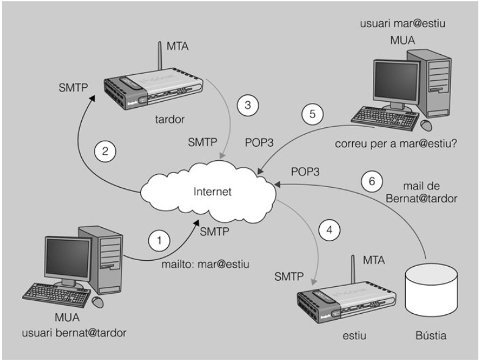

**Servicio de Correo Electrónico**

## 1. Introducción
El correo electrónico sigue siendo un pilar fundamental en la comunicación empresarial y personal, a pesar del auge de sistemas de mensajería instantánea. Empresas y organizaciones utilizan el email para comunicaciones internas y externas, integrándolo con herramientas en la nube, sistemas de gestión documental y marketing digital.

## 2. Principales Elementos del Servicio de Correo Electrónico
- **Cuentas de correo**: Asociadas a un usuario y un buzón de almacenamiento.
- **Redirecciones**: Permiten reenviar correos automáticamente a otras direcciones.
- **Alias**: Nombres alternativos para una cuenta.
- **Listas de distribución**: Grupos de direcciones a las que se envía el mismo mensaje.

## 3. Agentes del Servicio de Correo Electrónico
- **MTA (Mail Transfer Agent)**: Encargado de la transferencia entre servidores (ej. Postfix, Sendmail, Exim).
- **MDA (Mail Delivery Agent)**: Responsable de la entrega al buzón (ej. Dovecot, Procmail).
- **MUA (Mail User Agent)**: Cliente de correo para el usuario (ej. Thunderbird, Outlook, Roundcube).

## 4. Protocolos de Correo Electrónico
### 4.1. Protocolo SMTP (Simple Mail Transfer Protocol)
- Responsable del envío de correos.
- Utiliza el puerto 25 (envío sin cifrar) y 587/465 (seguro con STARTTLS/SSL).
- Integrado con sistemas de autenticación (SMTP AUTH) para evitar envío de spam.

["más información..."](smtp.md)

### 4.2. Protocolo POP3 (Post Office Protocol v3)
- Descarga correos al cliente y los elimina del servidor (según configuración).
- Usa el puerto 110 (sin cifrar) o 995 (con SSL/TLS).
- Apropiado para uso en dispositivos sin conexión continua.

["más información..."](pop3.md)

### 4.3. Protocolo IMAP (Internet Message Access Protocol)
- Permite acceso remoto sin necesidad de descargar los correos.
- Sincronización entre múltiples dispositivos.
- Puertos: 143 (sin cifrar) y 993 (con SSL/TLS).

["más información..."](imap.md)

## 5. Funcionamiento General del Correo Electrónico

1. Un usuario redacta un mensaje con su cliente MUA.
2. El cliente envía el mensaje al servidor mediante SMTP.
3. El MTA del servidor remitente reenvía el mensaje al servidor destinatario.
4. El servidor de destino almacena el mensaje en el buzón del usuario.
5. El usuario accede a su buzón mediante POP3/IMAP o Webmail.

Esquema del proceso de transmisión de correo electrónico (CC BY-SA)

En este caso, el usuario bernat@tardor quiere enviar un correo electrónico al usuario mar@estiu. Para hacerlo, el usuario redacta un mensaje con su agente de usuario de correo (MUA) y lo envía. Una vez el agente de transferencia de correo (MTA) de tardor recibe el mensaje, determina el punto de entrega. Como que no se trata de una cuenta de un usuario local (tienen dominios diferentes), certifica que bernat@tardor tiene permiso para utilizar este agente de transferencia de correo (MTA) para enviar correos a otros servidores -esto es relevante, por ejemplo, para evitar que se utilice un agente de transferencia de correo (MTA) de forma indiscriminada para enviar correo como si se tratara de correo basura. Definitivamente, el correo irá dirigido a otro servidor y, además, el cliente que lo envía tiene permiso para utilizar el agente de transferencia de correo (MTA). Por lo tanto, el servidor de tardor utiliza el protocolo SMTP para entregar el correo al agente de transferencia de correo (MTA) de estiu. Cuando el servidor de estiu haya recibido el mensaje, determinará el punto de entrega que, en este caso, es en una cuenta local. Por lo tanto, se dirigirá al buzón correspondiente y finalizará la entrega dejando el correo. Por último, en otro extremo de la red, el usuario mar@estiu utiliza su agente de usuario de correo (MUA) para comprobar si tiene algún correo nuevo. En este caso utilizará el protocolo POP3 de recogida de correo. Justo es decir que el servidor POP3 de estiu comprueba que el usuario sí que tenga correo (el que le envió bernat@tardor) y la entrega a su agente de usuario de correo (MUA). Es, llegados en este punto, cuando finaliza la recogida.

## 6. Clientes de Correo Electrónico
- **Clientes instalados**: Thunderbird, Outlook, Apple Mail.
- **Clientes Webmail**: Gmail, Outlook Web, Roundcube.
- **Clientes en Terminal**: Mutt, Alpine.

## 7. Seguridad en el Correo Electrónico
### 7.1. Protocolos Seguros
- **SSL/TLS**: Cifrado de conexión para SMTP, POP3 e IMAP.
- **DKIM (DomainKeys Identified Mail)**: Firma digital para validar autenticidad.
- **SPF (Sender Policy Framework)**: Previene la suplantación de direcciones de remitente.
- **DMARC (Domain-based Message Authentication, Reporting & Conformance)**: Permite a los dominios establecer políticas de autenticación.

### 7.2. Filtrado de Correo y Protección contra Spam
- Listas negras (RBL) y listas blancas.
- Sistemas antispam (SpamAssassin, Rspamd).
- Uso de CAPTCHA en formularios de suscripción.

### 7.3. Firma y Cifrado de Mensajes
- **S/MIME**: Cifrado con certificados X.509.
- **PGP (Pretty Good Privacy)**: Cifrado y autenticación con claves públicas y privadas.

## 8. Servidores de Correo Electrónico
- **Postfix**: Popular en servidores Linux.
- **Exim**: Utilizado por Debian y cPanel.
- **Microsoft Exchange**: Integrado en entornos empresariales Windows.
- **Zimbra**: Solución de código abierto con webmail y sincronización de calendarios.

