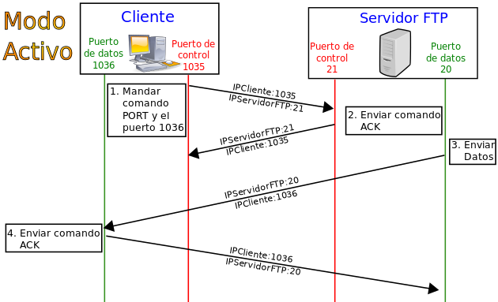
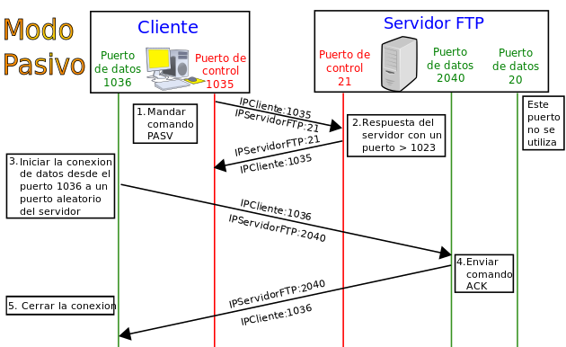

# Servicio de transferencia de ficheros
n servidor FTP es un programa especial que se ejecuta en un equipo servidor normalmente conectado a Internet. Su función es permitir el intercambio de datos entre diferentes servidores/ordenadores.

Por lo general, los programas servidores FTP no suelen encontrarse en los ordenadores personales, por lo que un usuario normalmente utilizará el FTP para conectarse remotamente a uno y así intercambiar información con él.

Las aplicaciones más comunes de los servidores FTP suelen ser el alojamiento web, en el que sus clientes utilizan el servicio para subir sus páginas web y sus archivos correspondientes; o como servidor de backup (copia de seguridad) de los archivos importantes que pueda tener una empresa.

## FTP
FTP son siglas de File Transfer Protocol, es un protocolo que lleva con nosotros desde la década de los 70 y fue diseñado para la transferencia de archivos a través de la red con  una configuración de cliente-servidor.

Su principal defecto es que carece de capa alguna de seguridad, los datos viajan por la red en texto plano, sin encriptación, de modo que es muy sencillo interceptar no solo los archivos que se transmiten sino también los datos de autentificación. Por otro lado, esta ausencia de encriptación es la responsable de que sea el protocolo de transmisión más rápido de los que veremos en esta entrada, pues no existe consumo de recursos relacionados con la encriptación y el tamaño de los paquetes transmitidos es menor.

## FTPS
Las siglas FTPS provienen de FTP over SSL y no es más que el protocolo estándar FTP transmitido sobre una conexión segura. Inicialmente la conexión segura hacía referencia únicamente  SSL (Secure Sockets Layer), pero con el  paso del tiempo y la aparición del protocolo TLS (Transport Layer Security), también soporta este último. Este protocolo hace uso de dos canales diferentes: uno de control y otro de transferencia, y tiene dos variantes bien diferenciadas:

1. **FTP implicito sobre SSL**. Recibe este nombre porque la conexión cifrada es implicita, es decir, ocurre desde un primer instante, sin necesidad de solicitarla, motivo por el cual además está desaconsejada (deprecated). Por defecto utiliza el puerto 990 para el canal de control y el 998 para el de datos, de forma que el puerto 21 permanece libre para poder ofrecer un servicio FTP estandar. En cualquier caso los dos canales viajan encriptados.
1. **FTP explicito sobre SSL o también conocido como FTPES**. El cliente establece una conexión FTP estándar mediante el puerto 21 con el servidor y una vez conectado se solicita explícitamente la negociación SSL, de ahí el nombre. En función de la configuración del servidor, si el cliente no solicita la encriptación es posible que ocurran dos cosas: que se rechace la conexión o que se establezca una conexión FTP estándar (insegura). Esta variante permite decidir si queremos encriptar los canales de control y transferencia o si por el contrario solo queremos encriptar uno de ellos.

Un aspecto que puede resultar negativo de este protocolo es que por el hecho de utilizar más de un canal puede resultar problemático con algunas configuraciones en los firewalls, así que es posible que si tenemos un firewall en funcionamiento e implementamos un servidor FTPS nos veremos obligados a revisar su configuración.

Tendremos que abrir puertos puertos para la transmisión de datos

# SFTP
SFTP o SSH File Transfer Protocol es un protocolo que «simula» el comportamiento del protocolo FTP pero que realmente poco o nada tiene que ver con él, no es una extensión o una mejora como puede ser FTPS, si no que fue desarrollado desde cero.

Tanto los datos de control como de transferencia se transmiten siempre encriptados y por un único canal, utilizando para ello el puerto 22 al igual que el protocolo SSH (Secure SHell) sobre el que está construido. Posiblemente por este motivo muchos servidores FTP implementan los protocolos FTP Y FTPS pero no SFTP. En su lugar podemos ver implementaciones  de servidores SFTP de la mano de los propios servidores de SSH, algunos ejemplos son OpenSSH o LSH.

## Modos de conexión en FTP

### Modo Activo
En modo Activo, el servidor siempre crea el canal de datos en su puerto 20, mientras que en el lado del cliente el canal de datos se asocia a un puerto aleatorio mayor que el 1024. Para ello, el cliente manda un comando PORT al servidor por el canal de control indicándole ese número de puerto, de manera que el servidor pueda abrirle una conexión de datos por donde se transferirán los archivos y los listados, en el puerto especificado.

Lo anterior tiene un grave problema de seguridad, y es que la máquina cliente debe estar dispuesta a aceptar cualquier conexión de entrada en un puerto superior al 1024, con los problemas que ello implica si tenemos el equipo conectado a una red insegura como Internet. De hecho, los cortafuegos que se instalen en el equipo para evitar ataques seguramente rechazarán esas conexiones aleatorias. Para solucionar esto se desarrolló el modo pasivo. Aunque realmente no es así ya que seguramente la seguridad tendrá un problema grave. 
### Modo Pasivo

Cuando el cliente envía un comando PASV sobre el canal de control, el servidor FTP le indica por el canal de control, el puerto (mayor a 1024 del servidor. Ejemplo:2040) al que debe conectarse el cliente. El cliente inicia una conexión desde el puerto siguiente al puerto de control (Ejemplo: 1036) hacia el puerto del servidor especificado anteriormente (Ejemplo: 2040)

Antes de cada nueva transferencia tanto en el modo Activo como en el Pasivo, el cliente debe enviar otra vez un comando de control (PORT o PASV, según el modo en el que haya conectado), y el servidor recibirá esa conexión de datos en un nuevo puerto (aleatorio si es en modo pasivo o por el puerto 20 si es en modo activo). 

## Comandos FTP
https://es.wikipedia.org/wiki/Protocolo_de_transferencia_de_archivos#Comandos_FTP

## Referencias 
* https://blog.ahierro.es/ftp-ftps-y-sftp-diferencias-ventajas-inconvenientes/
* https://es.wikipedia.org/wiki/Protocolo_de_transferencia_de_archivo