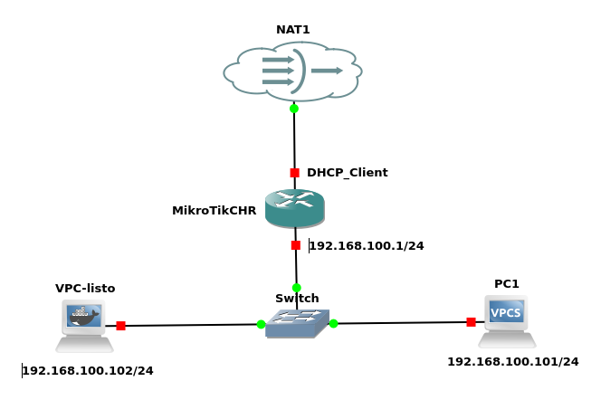

### **Prueba 1: Configuración de NAT y conectividad en MikroTik**  

#### **Objetivo**  
Configurar una red con un router MikroTik para proporcionar acceso a internet a los clientes mediante  "Masquerading" (enmascaramiento), tipo específico de NAT (Network Address Translation) llamado "Source NAT" (SNAT). Configurar las interfaces del MikroTik y establecer las direcciones IP estáticas en los clientes, asegurando la conectividad con Internet.  

#### **Descripción**  
El router MikroTik se conecta a Internet a través de su interfaz WAN, obteniendo una dirección IP mediante DHCP. La interfaz LAN del MikroTik está configurada con la dirección **192.168.100.1/24** y debe actuar como puerta de enlace para los dispositivos de la red local.  

1. **Configurar SNAT en MikroTik**  
   - Explicar qué es SNAT y su utilidad en redes privadas.  
   - Configurar SNAT en el router MikroTik para permitir que los dispositivos de la red local accedan a Internet.  

2. **Configurar interfaces en MikroTik**  
   - Asignar direcciones IP a las interfaces adecuadas.  
   - Asegurar que la interfaz WAN obtiene dirección IP por DHCP.  

3. **Configurar los equipos cliente**  
   - Asignar direcciones IP estáticas en los clientes:  
     - **PC1:** 192.168.100.101/24  
     - **VPC_listo:** 192.168.100.102/24  
   - Configurar la puerta de enlace (**192.168.100.1**) y servidores DNS adecuados.  

4. **Realizar pruebas de conectividad**  
   - Verificar que los clientes tienen configurada correctamente su IP y DNS.  
   - Realizar pruebas de conectividad a nivel de red (ping, traceroute).  
   - Comprobar que los clientes pueden navegar por Internet.  
