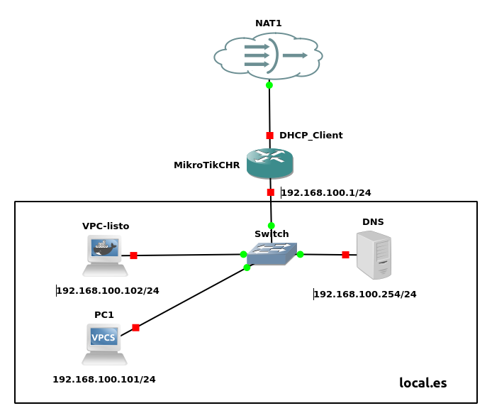

### **Prueba 2: Configuración de un servidor DNS con Dnsmasq**  

#### **Objetivo**  
Configurar un servidor **Dnsmasq** para que actúe como servidor DNS en la red, resolviendo nombres de dominio locales para los dispositivos conectados. Los alumnos deberán investigar y configurar las directivas necesarias para que el servidor traduzca los nombres de los equipos a sus direcciones IP estáticas.  

#### **Descripción**  
El servidor **DNS** se encargará de resolver los siguientes nombres de dominio:  
- **pc01.local.es → 192.168.100.101**  
- **vpclisto.local.es → 192.168.100.102**  
- **router.local.es → 192.168.100.1** 

    

Antes de proceder con la configuración, investigar y comprender el propósito de las siguientes directivas de **Dnsmasq**:  
- `interface=`  
- `domain=`   
- `local=`  
- `address=`   
- `no-resolv` 
- `server=` 

#### **Tareas a realizar**  
1. **Instalación y configuración de Dnsmasq**  
   - Instalar el paquete Dnsmasq en el servidor.  
   - Configurar las directivas necesarias en el archivo de configuración.  

2. **Definir el archivo de resolución de nombres locales**  
   - Añadir las entradas correspondientes en la configuración de Dnsmasq para resolver los nombres indicados.  

3. **Probar la resolución de nombres desde los clientes**  
   - Configurar los clientes para utilizar el servidor DNS configurado.  
   - Usar herramientas como o `dig` para verificar la resolución de nombres. Importante usar dig en cada pc cliente, especificando y sin especificar explicitamente el servidor DNS.

 
