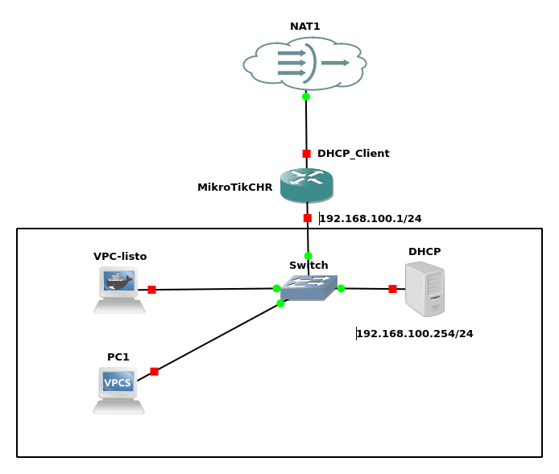

### **Prueba 3: Configuración de un servidor DHCP con Dnsmasq**  

#### **Objetivo**  
Configurar un servidor **Dnsmasq** para que funcione como servidor **DHCP** y asigne automáticamente direcciones IP, puerta de enlace y DNS a los clientes de la red. Los alumnos deberán investigar y configurar las directivas necesarias en **Dnsmasq** para que los clientes puedan obtener su configuración de red correctamente y acceder a Internet.  

#### **Descripción**  
En esta práctica, los alumnos configurarán un servidor DHCP con **Dnsmasq** en la máquina **DHCP (192.168.100.254/24)**. Este servidor deberá proporcionar direcciones IP dinámicas dentro de la subred **192.168.100.0/24**, asegurándose de asignar también los siguientes parámetros:  
- **Puerta de enlace (Gateway):** `192.168.100.1` (correspondiente al MikroTik)  
- **Servidor DNS:** `192.168.100.254` (el mismo servidor Dnsmasq)  
- **Rango de direcciones IP asignadas dinámicamente:** `192.168.100.100 - 192.168.100.200`  

Antes de configurar el servicio, los alumnos deben investigar el propósito de las siguientes directivas en Dnsmasq:  
- `interface=`  
- `dhcp-range=`  
- `dhcp-option=` 
- `dhcp-host=`  
- `domain=`  

---

#### **Tareas a realizar**  
1. **Configurar el servidor DHCP en Dnsmasq**  
   - Instalar y configurar **Dnsmasq** en la máquina **DHCP**.  
   - Definir el rango de direcciones IP a asignar.  
   - Configurar la puerta de enlace y el servidor DNS.  

2. **Configurar los clientes para obtener IP por DHCP**  
   - Configurar los equipos **PC1** y **VPC-listo** para que obtengan la IP automáticamente.  

3. **Realizar pruebas de conectividad**  
   - Verificar que los clientes reciben la configuración de red correcta  
   - Comprobar la dirección IP asignada, la puerta de enlace y el servidor DNS.  
   - Hacer pruebas de navegación.  

