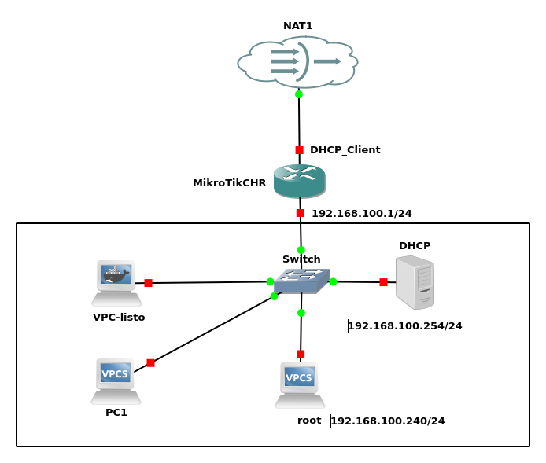

### **Prueba 4: Configuración de una reserva de IP en el servidor DHCP con Dnsmasq**  

#### **Objetivo**  
Extender la configuración del servidor DHCP en **Dnsmasq** para incluir una reserva de dirección IP. Se deberá asignar la IP **192.168.100.240** de forma estática al equipo **root**, asegurándose de que siempre reciba la misma dirección IP. Está prueba realizala dos veces. En la primera utiliza en root un VPC y en la segunda utiliza un VPC-listo  

#### **Descripción**  
Los alumnos deben modificar la configuración de **Dnsmasq** en el servidor **DHCP (192.168.100.254/24)** para reservar la dirección **192.168.100.240** exclusivamente para el equipo **root**, utilizando su dirección **MAC**.  

Antes de implementar la configuración, deberán investigar el uso de la directiva:  
- `dhcp-host=` → Permite asociar una dirección MAC con una IP estática.  

---

#### **Tareas a realizar**  

1. **Identificar la dirección MAC del equipo root**  
2. **Configurar la reserva en Dnsmasq**  
3. **Realizar pruebas de conectividad**  
   - Hacer ping al MikroTik (**192.168.100.1**) y a una dirección externa como **8.8.8.8**.  
   - Capacidad del equipo root para conectarse a la red y navegar por Internet  
