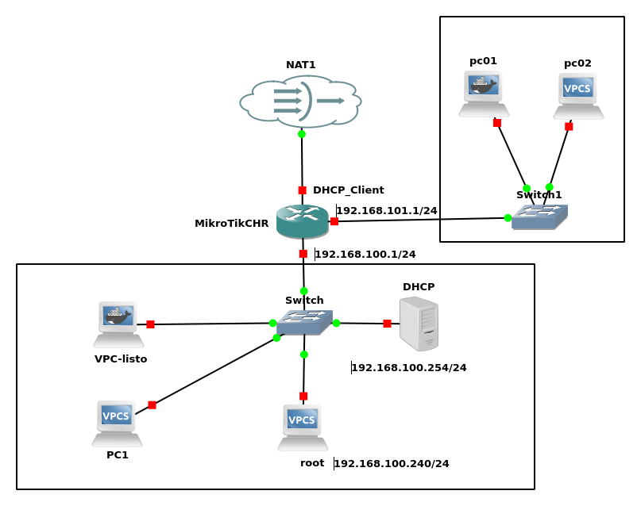

### **Prueba 5: Configuración de una nueva red y DHCP Relay en MikroTik**  

#### **Objetivo**  
Configurar una nueva red **192.168.101.0/24** en el MikroTik, añadiendo una interfaz para esta red y configurando el MikroTik como un **DHCP Relay**. El servidor DHCP principal (192.168.100.254) seguirá asignando direcciones IP a los clientes de la nueva red a través del relay.  

#### **Descripción**  
Los alumnos deben modificar la configuración del **MikroTik** para incluir una nueva interfaz en la red **192.168.101.0/24** y configurar su función como **DHCP Relay**, de modo que los clientes de esta nueva red puedan obtener direcciones IP desde el servidor DHCP existente en **192.168.100.254**.  

Antes de implementar la configuración, deberán investigar y comprender:  
- **Creación y configuración de una nueva interfaz en MikroTik.**  
- **Funcionamiento del DHCP Relay y su utilidad en redes segmentadas.**  
- **Directivas de Dnsmasq relevantes para soportar múltiples subredes.**  

---

#### **Tareas a realizar**  

1. **Configurar la nueva interfaz en MikroTik**  
   - Crear una nueva interfaz en **MikroTik** y asignarle la IP **192.168.101.1/24**.  
   - Configurar esta interfaz para que funcione como puerta de enlace para la nueva red.  

2. **Configurar el MikroTik como DHCP Relay**  
   - Configurar el **DHCP Relay** en MikroTik para que reenvíe las solicitudes DHCP desde la red **192.168.101.0/24** al servidor DHCP en **192.168.100.254**.  

3. **Modificar la configuración del servidor DHCP (Dnsmasq) para admitir la nueva red**  
   - Configurar **Dnsmasq** en **192.168.100.254** para gestionar direcciones en **192.168.101.0/24**.  
   - Definir un nuevo rango de direcciones IP para esta subred (por ejemplo, **192.168.101.100 - 192.168.101.200**).  
   - Asegurar que la puerta de enlace asignada sea **192.168.101.1**.  

4. **Configurar clientes en la nueva red**  
   - Conectar un equipo cliente a la nueva red y configurar su interfaz para obtener IP por DHCP.  
   - Verificar que obtiene una dirección IP válida desde el servidor DHCP.  

5. **Realizar pruebas de conectividad**  
   - Comprobar que los clientes en la nueva red pueden comunicarse con MikroTik y con clientes de la red **192.168.100.0/24**.  
   - Verificar que los clientes pueden acceder a Internet .  
