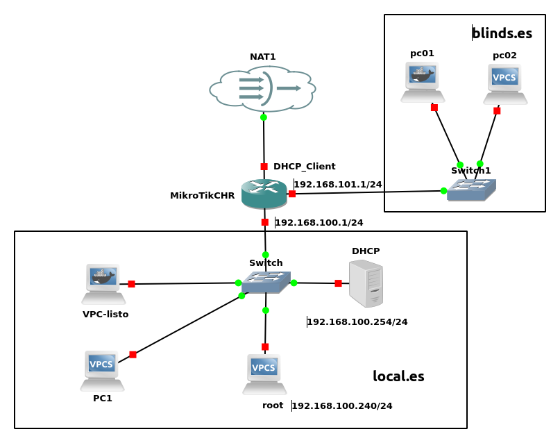

### **Prueba Integrada: Configuración de Redes y Servidores con DHCP Relay y DNS Dinámico utilizando Dnsmasq**

#### **Objetivo**  
Configurar dos redes **192.168.1.0/24** y **192.168.2.0/24**, cada una con su respectiva configuración de DNS dinámica, utilizando nombres de dominio `local.es` para la primera red y `blinds.es` para la segunda red. Asegurarse de que los clientes obtienen direcciones IP a través de un servidor DHCP relay y que pueden resolver los dominios configurados mediante un servidor DNS. El servidor **Dnsmasq** debe estar completamente configurado para gestionar tanto DHCP como DNS.

#### **Descripción**  
Los alumnos deben configurar un servidor **Dnsmasq** en **Ubuntu Server** con las siguientes características:  
- **Primera red (192.168.1.0/24)**: Los clientes deben obtener direcciones IP dentro del rango **192.168.1.100 - 192.168.1.200** y ser capaces de resolver el dominio `local.es` usando el servidor DNS de **Dnsmasq**. Y, acceso a internet
- **Segunda red (192.168.2.0/24)**: Los clientes deben obtener direcciones IP dentro del rango **192.168.2.100 - 192.168.2.200** y resolver el dominio `blinds.es` mediante el servidor DNS configurado en **Dnsmasq**.  Y, acceso a internet

Estudia la siguiente directiva

- dhcp-option=tag:<tag>,option:<opción>,<valor>: 

Para implementar esta configuración, seguir los siguientes pasos:

---

### **Tareas a realizar**  

1. **Configurar el Servidor DHCP para las dos redes con Dnsmasq**  
   - Configurar **Dnsmasq** para gestionar dos subredes:  
     - **Red 1** (192.168.1.0/24), con un rango de direcciones **192.168.1.100 - 192.168.1.200** y el nombre de dominio `local.es`.  
     - **Red 2** (192.168.2.0/24), con un rango de direcciones **192.168.2.100 - 192.168.2.200** y el nombre de dominio `blinds.es`.  
   - Configurar las directivas de **Dnsmasq** para asegurar que cada red obtenga la puerta de enlace correcta y los servidores DNS asignados.

2. **Configurar el servidor DNS para resolver los dominios `local.es` y `blinds.es` con Dnsmasq**  
   - Configurar **Dnsmasq** para resolver las zonas `local.es` y `blinds.es`.  
   - Añadir registros de tipo **A** para las zonas `local.es` y `blinds.es` para que el servidor DNS pueda resolver los nombres de dominio a las direcciones IP de los servidores correspondientes.  
   - Asegurar que la configuración permita la resolución de nombres en ambas redes de forma independiente.

3. **Configurar MikroTik como DHCP Relay**  
   - Configurar el MikroTik para agregar la nueva interfaz de red **192.168.2.0/24** y configurar un **DHCP Relay** para que las solicitudes DHCP de la red 192.168.2.0/24 se reenvíen al servidor **Dnsmasq** en **192.168.100.254**.  

4. **Verificación de la configuración**  
   - Conectar un cliente en cada red y asegurarse de que obtienen una dirección IP válida desde el servidor **Dnsmasq**.  
   - Verificar que los clientes pueden resolver los dominios `local.es` y `blinds.es` utilizando el servidor DNS configurado en **Dnsmasq**.  
   - Comprobar la conectividad entre los clientes en las redes **192.168.1.0/24** y **192.168.2.0/24**, y con el servidor DHCP, asegurando que el tráfico de red fluye correctamente.
