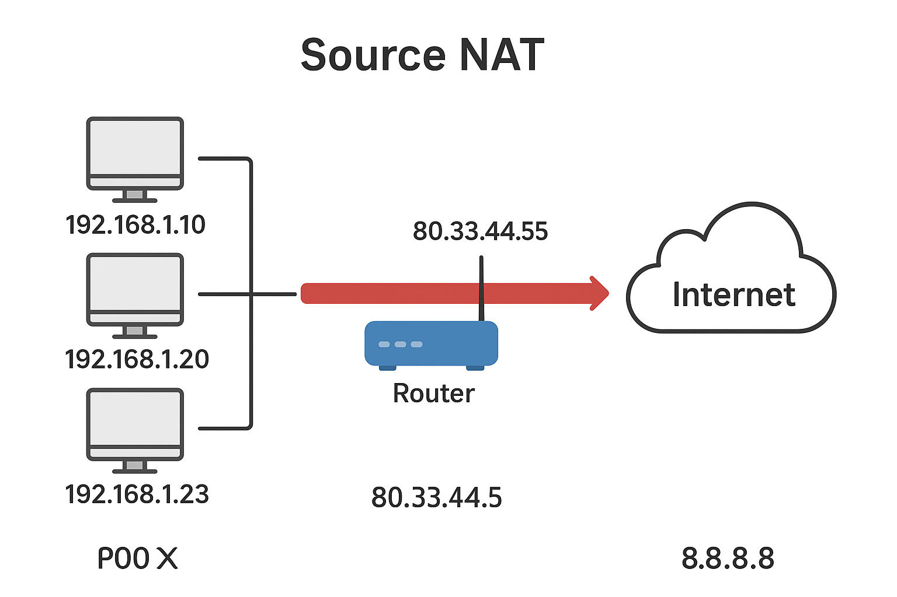

# ¿Cómo funciona NAT y concretamente SNAT?

**NAT** (Network Address Translation) es una técnica utilizada en redes para modificar las direcciones IP en los encabezados de los paquetes mientras atraviesan un router o firewall. Su objetivo principal es permitir que múltiples dispositivos en una red local (privada) accedan a recursos externos (como Internet) usando una sola dirección IP pública.

Que un dispositivo Haga de router significa simplemente reenviar paquetes entre diferentes redes (por ejemplo, entre una red local y otra red o Internet), manteniendo las direcciones IP originales de origen y destino. El router solo actúa como intermediario.

Que un dispositivo configure SNAT (Source NAT) implica que el router, además de reenviar los paquetes, modifica la dirección IP de origen de los paquetes salientes.



## Tipos de NAT

- **SNAT (Source NAT):** Cambia la dirección IP de origen de los paquetes que salen de la red local hacia el exterior. Es comúnmente usado para que varios dispositivos compartan una única IP pública.
- **DNAT (Destination NAT):** Cambia la dirección IP de destino de los paquetes que llegan desde el exterior, redirigiéndolos a un dispositivo específico dentro de la red local.

## Funcionamiento de SNAT

Cuando un dispositivo de la red local envía un paquete hacia Internet:
1. El router con SNAT reemplaza la IP de origen privada por su propia IP pública.
2. El router guarda una tabla de traducción para recordar qué conexión corresponde a cada dispositivo interno.
3. Cuando la respuesta regresa, el router consulta la tabla y reenvía el paquete al dispositivo interno correcto.

## Ejemplo paso a paso: 

Supongamos que un dispositivo con IP privada `192.168.1.10` quiere acceder a `https://ejemplo.com` (puerto 443) a través de un router con SNAT y una IP pública `203.0.113.5`.

1. **El dispositivo inicia la conexión:**
    - Origen: `192.168.1.10:12345` (puerto aleatorio)
    - Destino: `93.184.216.34:443` (IP de ejemplo.com, puerto HTTPS)

2. **El paquete llega al router con SNAT:**
    - El router reemplaza la IP de origen privada por su IP pública.
    - Nuevo paquete:
      - Origen: `203.0.113.5:40001` (puerto aleatorio asignado por el router)
      - Destino: `93.184.216.34:443`
    - El router guarda en su tabla de traducción:
      ```
      203.0.113.5:40001 <-> 192.168.1.10:12345
      ```

3. **El paquete viaja por Internet hasta el servidor web.**

4. **El servidor responde al router:**
    - Origen: `93.184.216.34:443`
    - Destino: `203.0.113.5:40001`

5. **El router recibe la respuesta y consulta su tabla de traducción:**
    - Encuentra que `203.0.113.5:40001` corresponde a `192.168.1.10:12345`.
    - Modifica el paquete para que:
      - Origen: `93.184.216.34:443`
      - Destino: `192.168.1.10:12345`

6. **El dispositivo recibe la respuesta y continúa la comunicación de forma transparente.**

Este proceso se repite para cada conexión nueva, permitiendo que múltiples dispositivos compartan la misma IP pública sin conflictos.

## ¿Cómo ver la tabla SNAT?

### En Ubuntu Server (Noble)

Puedes ver las reglas y la tabla de conexiones SNAT usando los siguientes comandos:

- **Ver reglas SNAT configuradas (iptables):**
    ```sh
    sudo iptables -t nat -L -n -v
    ```

- **Ver la tabla de conexiones NAT activas:**
    ```sh
    sudo conntrack -L
    ```
    > Si `conntrack` no está instalado, puedes instalarlo con:
    > ```sh
    > sudo apt update && sudo apt install conntrack
    > ```

### En MikroTik

1. **Ver reglas SNAT configuradas:**
     - Ingresa por terminal (Winbox, SSH o WebFig) y ejecuta:
         ```
         /ip firewall nat print where action=src-nat
         ```

2. **Ver conexiones activas (tabla de traducción):**
     ```
     /ip firewall connection print
     ```

Estas herramientas te permiten inspeccionar tanto las reglas SNAT como las conexiones activas que están siendo traducidas en tiempo real.